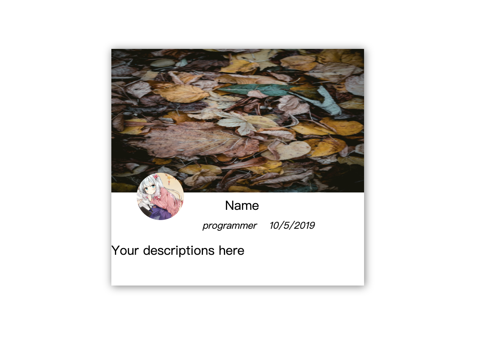

# user-card
a web component using Polymer library 3.

### Overview



### Installation

1. use `npm install` to install node dependencies:

   ```shell
   $ npm install
   ```

2. Start the component, here I use `browser-sync` to proxy `polymer-cli` port:

   ```shell
   $ npm start
   ```

   

### FYI

This is my first time writing `web component`, so I'd be appreciated if you have any suggestions on `web components` or `Polymer` to me  ❤️